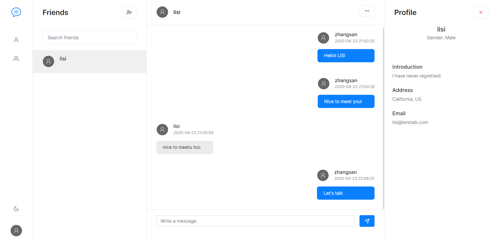

### 基于SpringBoot、WebSocket的聊天系统

效果展示账号：

| Id   | username | password |
| ---- | -------- | -------- |
|  1   | zhangsan | zhangsan |
|  2   | lisi     | lisi     |
|  3   | 群主     | qunzhu   |

**用户界面截图**

##### 相关技术栈

数据库为 MySQL，数据库操作由 Spring Data JPA 实现，前端页面由 thymeleaf 模板引擎驱动，消息接收和推送由 WebSocket 实现，前端事务处理主要由 JQuery 实现，数据通过 ajax 请求从后台控制器获得，后台控制器基本采用RESTful规范传输JSON格式数据，页面样式效果主要由 Bootstrap 实现。

##### 现有功能

(1) 能够进行用户的登录、注册；

(2) 用户能够对自己的个人信息进行查看、编辑操作；

(3) 用户能够根据用户编号查找其它用户的个人信息；

(4) 用户对查找到的用户进行添加好友操作；

(5) 用户能够选择好友列表中的好友，与其聊天，查看与其聊天的记录，接收离线聊天消息推送；

(6) 用户能够建立、加入群组，能够在群组中聊天，查看群组内的聊天记录，接收离线群聊天消息推送。

目前仍然在完善功能
